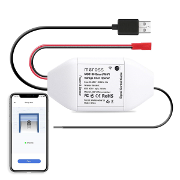

Plugin jeedom MerosSync
========================

Plugin jeedom permettant de contrôler les équipements Meross.

# Testé sur :
- Jeedom 4.2

# Ce qui fonctionne :
- Fonctionnalités on/off (y compris multi prises)
- Récupération des consommations / puissance / intensité / voltage
- Synchronisation toutes les 10 minutes (pour éviter)

# Equipements compatbiles :

<table>
  <tr>
    <td>MOD150</td>
    <td>Diffuseur huiles essentielles</td>
    <td></td>
  </tr>
  <tr>
    <td>MSS310</td>
    <td>Prise connectée avec mesure consommation</td>
    <td></td>
  </tr>
  <tr>
    <td>MSS620</td>
    <td>Multiprise extérieure</td>
    <td></td>
  </tr>
  <tr>
    <td>MSG100</td>
    <td>Porte de garage</td>
    <td></td>
  </tr>
  <tr>
    <td>MRS100</td>
    <td>Interrupteur volet roulant</td>
    <td></td>
  </tr>
</table>

Pour ajouter des compatibilités : me contacter !

# Documentation complète :
[Consultez la documentation](https://www.gowa.fr/plugin-jeedom)

# Changelog :
[Consultez le changelog](docs/fr_FR/changelog.md)

N'hésitez pas à me contacter pour toutes questions

A bientôt
