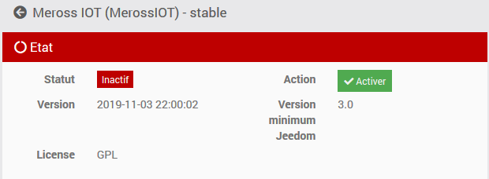
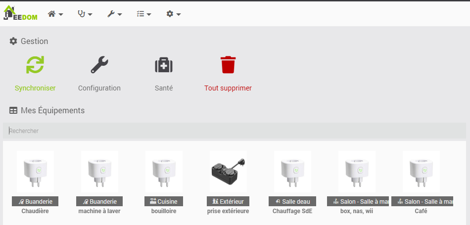
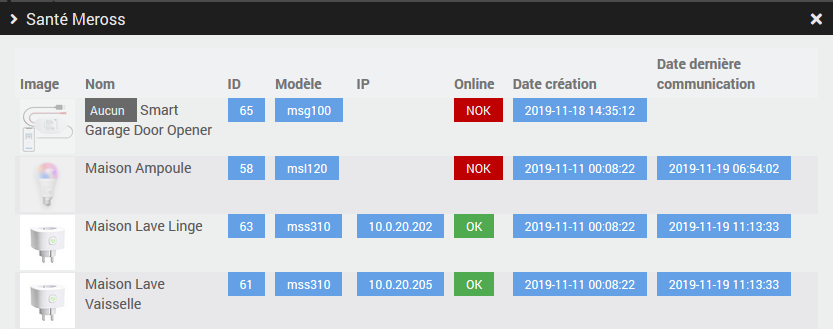

MerosSync
==========

Description
-----------

Plugin permettant de contrôler les équipements Meross.

Installation
============

a. Installation

- Télécharger le plugin

- Activer le plugin

b. Dépendances

> **Important**
>
> Il est très vivement recommandé de lancer l’installation des dépendances (même si elles apparaissent OK). Puis à la fin de rafraichir la page.

c. Configuration

- Renseigner vos identifiants MEROSS

- Choisir la fréquence d'actualisation de la puissance des prises compatibles (en secondes)

Le plugin
=========

Rendez vous dans le menu Plugins &gt; Protocole Domotique pour retrouver le plugin.

Sur la partie haute de cette page, vous avez plusieurs boutons.

- Bouton Synchroniser : Créer / Met à jour les équipements et leurs valeurs depuis le cloud Meross.
- Bouton Configuration : Ouvre la fenêtre de configuration du plugin.
- Bouton Santé : Aperçu de la santé de tous vos équipements.
- Bouton Tout supprimer : Efface tout vos équipements afin de les recréer.

> **Important**
>
> Si vous sélectionnez Tout supprimer, toutes les équipements et leurs commandes seront supprimer et leur ID seront modifiés.

a. Equipements

Lorsque que vous cliquez sur un équipement, vous arrivez sur la page de configuration de celui-ci. Comme partout dans Jeedom vous pouvez ici :

- Donner un nom au module.
- L’activer/le rendre visible ou non.
- Choisir son objet parent.
- Lui attribuer une catégorie.

Et en dessous vous pouvez consulter :

- Le modèle
- L'adresse MAC
- L'adresse IP

b. Santé

Utilisation
=========

Il vous suffit de cliquer sur les fonctions des widgets

